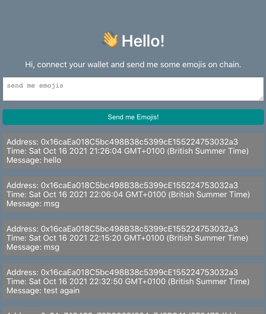

# Basic Web3.js Project

A basic web3 app that posts emojis to the ethereum rinkeby testnet network.

local script run
```shell
npx hardhat run scripts/run.js
```
start local Ethereum network
```shell
npx hardhat node
```
deploy locally
```shell
npx hardhat run scripts/deploy.js --network localhost
```
deploy on rinkeby testnet
```shell
npx hardhat run scripts/deploy.js --network rinkeby
```

### Screenshots



